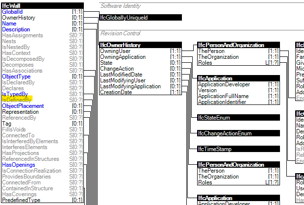
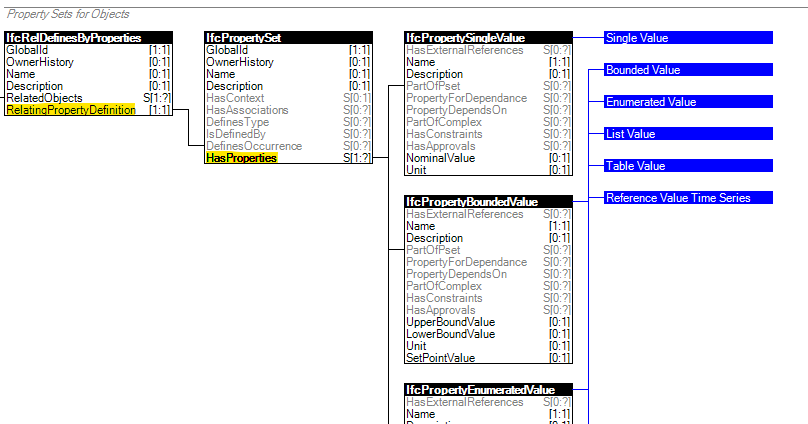
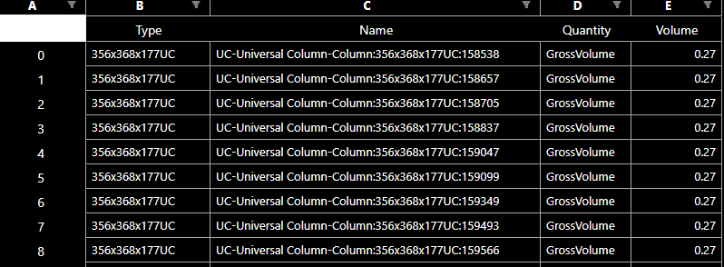

# Projeto de Tratamento de dados de ficheiro IFC 

Projeto com intuito de demonstrar o processo de extração de informações de um ficheiro IFC através de scripts desenvolvidos na linguagem de programação Python, com recurso à biblioteca [IfcOpenShell](http://ifcopenshell.org/).

## Resumo do processo executado no scripts

O processo de extração de informações de um ficheiro IFC com resurso à biblioteca IfcOpenShell tem por princípio a importação do ficheiro IFC e axploração das informações nele contidas através do schema IFC. Assim, é possível utilizar a "object dot notation" para acessar as propriedades e relações do IFC em sintaxe Python.

Um exemplo disto pode ser visto a seguir:



Considerando uma instância da classe IfcWall, para acessar o set de IfcRelDefinesByProperties, o código seria simplesmente:

```
# Atribui set IfcRelDefinesByProperties à variável x
x = ifcWall.IsDefinedBy

```
Depois é possível aceder às demais propriedades através das suas relações, com a utilização de loops se necessário.



Assim, para obter um set IfcPropertySingleValue a partir de um IfcWall, considerando o diagrama da imagem acima, o código seria:


```
# Atribui set IfcRelDefinesByProperties à variável x
IfcRelDefinesByProperties_set = ifcWall.IsDefinedBy

# Loop em todos os elementos do set criado
for IfcRelDefinesByProperties in IfcRelDefinesByProperties_set:
    IfcPropertySet = IfcRelDefinesByProperties.RelatingPropertyDefinition

    IfcPropertySingleValue_set = IfcPropertySet.HasProperties

```

## Exemplo desenvolvido 

O exemplo desenvolvido tem por objetivo extrair a informações de todas as colunas de um determinado ficheiro ifc para demonstrar o fluxo de trabalhos com a utilização do IfcOpenShell. Assim os passos executados foram:

1. Importação de bibliotecas;
2. Abertura de ficheiro IFC;
3. Query para seleção de todas instâncias de IfcColumn;
4. Loop no set de colunas obtidas para extração de informçãoes;
5. Criação de dataframe para armazenamento das informações;
6. Criação de ficheiro excel a partir de dataframe;

Um dos resultados obtidos pode ser visto na imagem seguinte:



## Autor 

[Bruno Muniz](https://github.com/Muniz1994)


